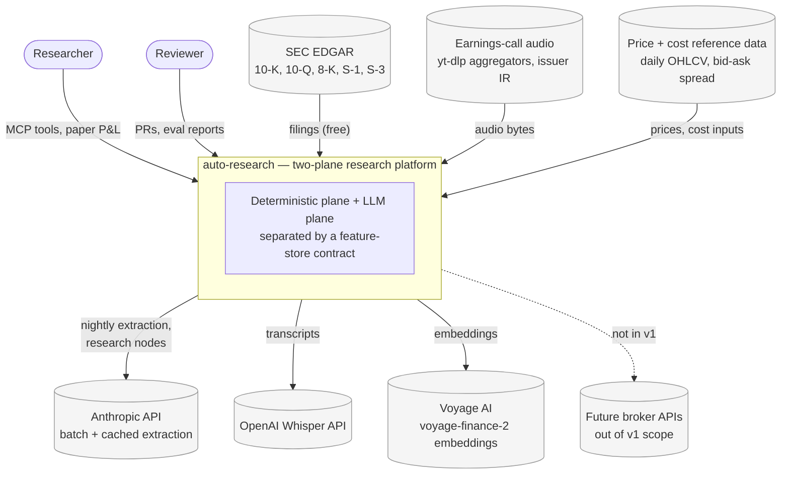
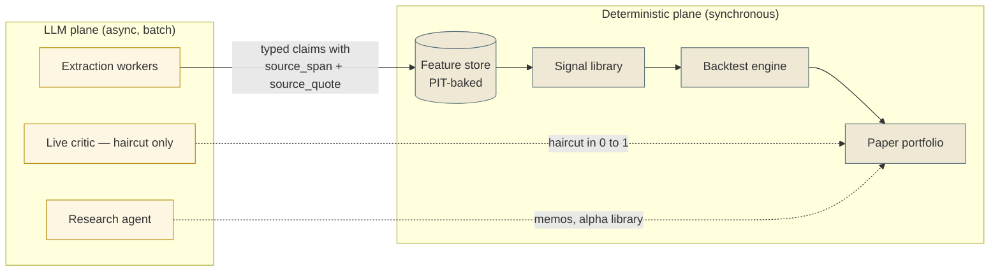
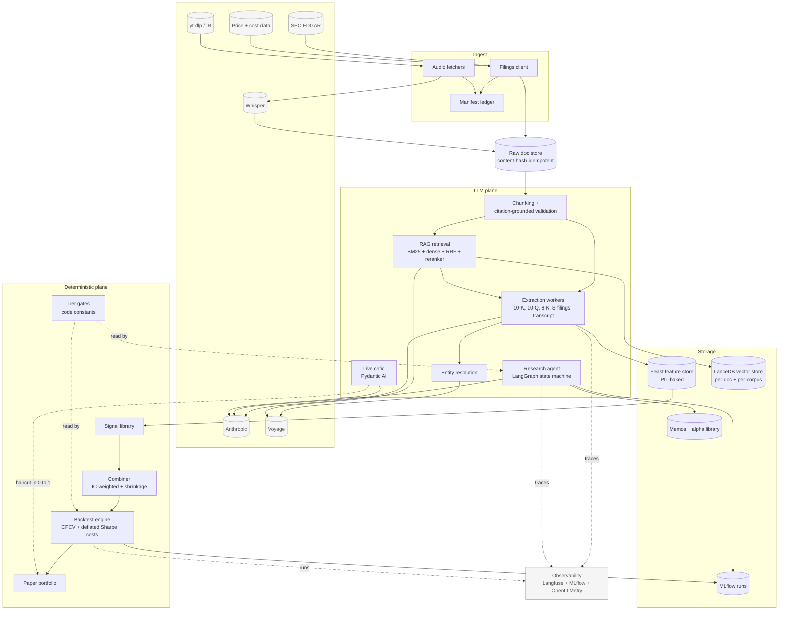
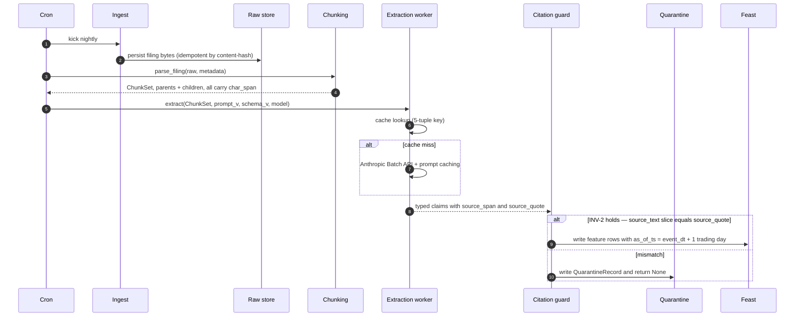
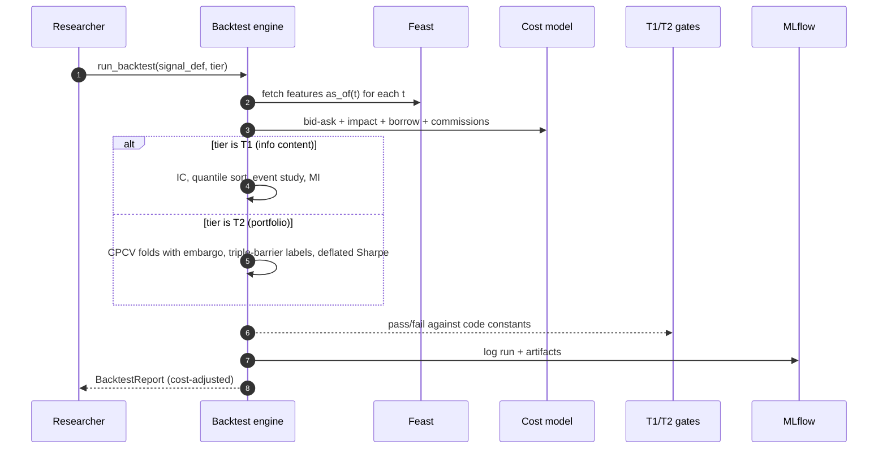
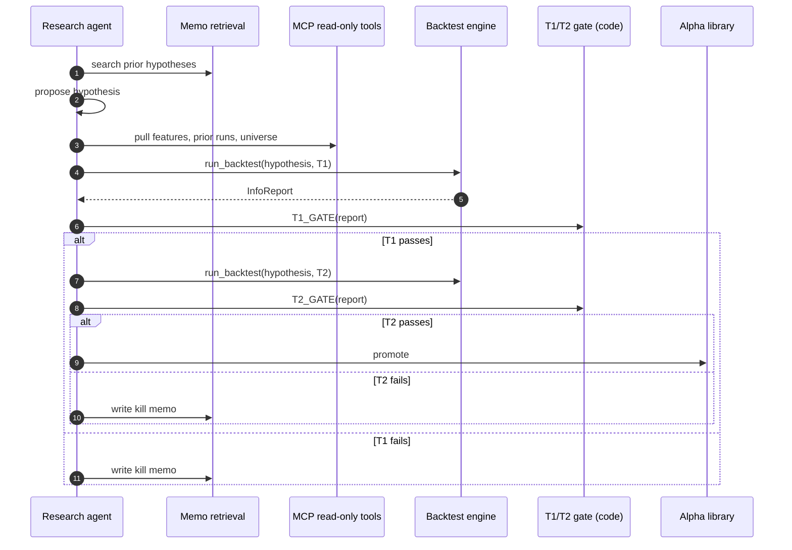

# Architecture

Current architecture, loosely structured as a C4 (Context → Container →
Component) view with Mermaid diagrams. Time-invariant — captures the
*shape* of the system, not the current file layout. For module-level
specifics see `CONTRACTS.md` (Pydantic surfaces), `DATA_MODEL.md` (Feast
schema), and `BACKTEST.md` (validation gates). For the original v1
design rationale see `docs/specs/2026-05-22-design.md`.

---

## 1. System context (C4 L1)

The platform reads SEC filings + earnings-call audio and produces a
paper-traded long/short signal. External actors and data sources sit
outside the trust boundary; everything inside the box is owned code or
locally-hosted infrastructure.

---

## 2. The two-plane invariant

The dominant architectural decision: the LLM never sits in the trading-
decision path. Extraction and research are batch/async; the live
trading loop is fully deterministic.

**Why this matters.** Every cross-plane edge is a code-checked,
schema-validated, time-aware contract — not an LLM prompt. The
research agent's promote/iterate/kill judgment is a code gate
(`T1_GATE`, `T2_GATE`), not a model output. The live critic's
multiplicative haircut can dampen positions but cannot flip sign.

---

## 3. Containers (C4 L2)

Logical containers and their internal responsibilities. Container
boundaries are stable; the file/module mapping evolves and lives in
the code itself.

Container responsibilities, time-invariant:

| Container | Owns | Does not own |
|---|---|---|
| Ingest | Fetch, persist raw bytes, append to manifest | Parsing, interpretation |
| Chunking | Section detection, parent/child chunking, char_span fidelity | LLM calls, embeddings |
| RAG retrieval | Hybrid retrieve + rerank over LanceDB | Embedding generation policy |
| Extraction workers | (raw_doc, prompt_v, schema_v, model, decoding) → typed claims | Where to store, how to combine |
| Entity resolution | Fuzzy mention → ticker disambiguation | Universe definition |
| Feast feature store | PIT discipline, lag-1 baking, schema versioning | Anything outside features |
| Signals | Per-name daily alpha components from features | Position state, costs |
| Backtest engine | CPCV folds, deflated Sharpe, cost-plumbed PnL | Live execution |
| Research agent | Hypothesis → validate → memo loop | Promote/iterate/kill decision (code gates own this) |
| Live critic | Daily multiplicative haircut from news | Position direction |
| Paper portfolio | Position state, P&L attribution | Anything LLM |

---

## 4. Key flows (sequence)

### 4.1 Nightly extraction

After a mismatch the worker must not persist the output anywhere
downstream — the quarantine record is the only artifact retained for
audit.

### 4.2 Daily backtest dispatch

### 4.3 Research-agent loop

The gate is a code constant (`T1_GATE`, `T2_GATE`), not an LLM
judgment — the agent reads the constant and branches on it, so
promote/iterate/kill decisions are mechanically checkable in code
review, not trusted to a model output.

---

## 5. Cross-cutting concerns

### 5.1 Invariants

Owned by `AGENTS.md` §2 (single source of truth). Summarized here for
context only:

- **INV-1 PIT discipline** — every feature row's `as_of_ts` is baked at
  write-time; lookahead is architecturally impossible.
- **INV-2 Citation grounding** — every extracted claim carries
  `source_span` + `source_quote`; post-validation asserts the slice
  identity. Chunking carries the same contract via `char_span`.
- **INV-3 LLM off the trading path** — see §2 above.
- **INV-4 López-de-Prado backtest discipline** — CPCV, triple-barrier,
  deflated Sharpe.
- **INV-5 Costs plumbed, not assumed.**
- **INV-6 Determinism** — extraction is a pure function of
  (raw_doc, prompt_v, schema_v, model_id, decoding_params), content-
  hash cached. Prompt + schema versions are co-pinned in code.
- **INV-7 Secrets stay out of logs.**

### 5.2 Tiered change-risk classification

`docs/AI_WORKFLOW.md` §2 — every code change classified Tier 0/1/2.
Tier 2 (sensitive paths) requires failing-test-first, named test
evidence, and a Change Contract block in the PR body.

### 5.3 Observability

Strategy ratified in `docs/specs/2026-05-22-design.md` §15: one tracing
backend (Langfuse via OTLP) for LLM-touching code, one experiment store
(MLflow) for backtests/signals, DuckDB notebooks for ad-hoc analysis,
no infra metrics layer (Prometheus/Grafana is out of scope by design
for v1).

**Single init point.** Every process that does I/O calls
`auto_research.telemetry.try_init_telemetry()` at start. The strict
`init_telemetry()` variant is reserved for tests and the integration
smoke; the CLI uses the env-tolerant wrapper so commands stay usable
when Langfuse isn't running locally (a one-line stderr warning fires
exactly once per process; spans become no-ops).

**Entry-point catalog.**

| Entry point | Init call site |
|---|---|
| `auto-research ingest edgar` | `src/auto_research/cli.py:ingest_edgar` |
| `auto-research extract s-filings` | `src/auto_research/cli.py:extract_s_filings` |
| `auto-research feast apply` | `src/auto_research/cli.py:feast_apply` |
| `auto-research feast materialize` | `src/auto_research/cli.py:feast_materialize` |
| Integration tests under `tests/integration/` | `init_telemetry()` (strict) |
| Future: nightly batch worker (#19), live critic | call `try_init_telemetry()` at process start |

**Manual-span boundaries.** Auto-instrumentation via OpenLLMetry
covers Anthropic / Whisper / future LangChain SDK calls. Manual spans
exist only at orchestration boundaries where parent/child grouping
matters operationally:

| Span | Emitter | Key attributes |
|---|---|---|
| `edgar.fetch_filings_for_cik` | `ingest/edgar.py` | `edgar.cik`, `edgar.form_types`, `edgar.n_filings`, `edgar.n_fetched`, `edgar.n_cache_hits` |
| `transcript.fetch` | `ingest/transcripts/__init__.py` | `transcript.ticker`, `.year`, `.quarter`, `.source_name`, `.outcome` |
| `transcript.find_audio_url` | `ingest/transcripts/sources/youtube.py` | `transcript.query`, `transcript.result_count`, `transcript.matched` |
| `transcript.download` | `youtube.py` + `direct_mp3.py` | `transcript.source_name`, `transcript.bytes`, `transcript.duration_ms` |
| `extract.s_filings` | `extract/workers/s_filings.py` | `extract.worker`, `extract.doc_id`, `extract.outcome` (cache_hit / persisted / quarantined) |

LLM cost (`llm.cost.est_usd`) is set on the active span by
`extract/client.py` after each SDK call — workers do not duplicate
this; under `extract.s_filings` the attribute now rolls up to the
named worker boundary.

**No-op safety.** When telemetry isn't initialized in a process,
`get_current_span()` returns OTel's default no-op span and
`start_as_current_span` is a cheap pass-through. Production code
emits spans unconditionally; the cost when nothing is listening is
a few attribute dict writes that go nowhere.

**Test discipline.** Unit tests assert span emission via the
`span_recorder` fixture in `tests/conftest.py` (in-memory
`InMemorySpanExporter`). End-to-end delivery to Langfuse is covered by
`tests/integration/test_telemetry_export.py` (requires Docker up).

**Backends:**
- **Langfuse** — every LLM call (extraction, research, critic) traced
  via OpenLLMetry; prompt registry + cost tracking.
- **MLflow** — every backtest run + signal promotion event; alpha
  library is MLflow-backed.
- **Hermetic tests** — `make test` uses no network, no Docker, no API
  keys. `make integration` uses Docker; `make live-smoke` hits real
  endpoints.

### 5.4 Storage layout

| Surface | Discipline |
|---|---|
| Raw bytes | Content-hash idempotent. Append-only. |
| Extracted JSONL | Per-worker. Version-pinned by `(prompt_v, schema_v)`. |
| Quarantine | `data/quarantine/<worker>/<doc_id>.json`. Never deleted; audit trail. |
| Feast offline | Parquet, PIT-baked `as_of_ts`. Schema migrations explicit. |
| LanceDB | Per-doc + per-corpus narrative store. Index-time filterable. |
| Memos | Markdown + LanceDB embedding for retrieval. |
| MLflow | Local file store (dev) → DB (when promoted to prod). |

---

## 6. Where to look when…

| Task | Start here |
|---|---|
| Add a new extraction field | `CONTRACTS.md` §1 (Pydantic surface), then the relevant worker |
| Change a feature definition | `DATA_MODEL.md`, then Feast feature views |
| Add or tune a signal | `BACKTEST.md` §2 (tier gates), then the signal library |
| Modify backtest math | `BACKTEST.md` §3-5, then the relevant backtest module |
| Add a research-agent tool | `CONTRACTS.md` §2 (MCP surface), then `mcp_server.py` |
| Change LLM model routing | `docs/specs/2026-05-22-design.md` §7.3, then the worker |
| Debug a failing eval | `AI_WORKFLOW.md` §5 (PR evidence template), then the eval suite |
| Modify chunking / char_span behavior | this doc §2 (two-plane invariant), `AGENTS.md` §3 (sensitive paths), then `extract/chunking.py` |
